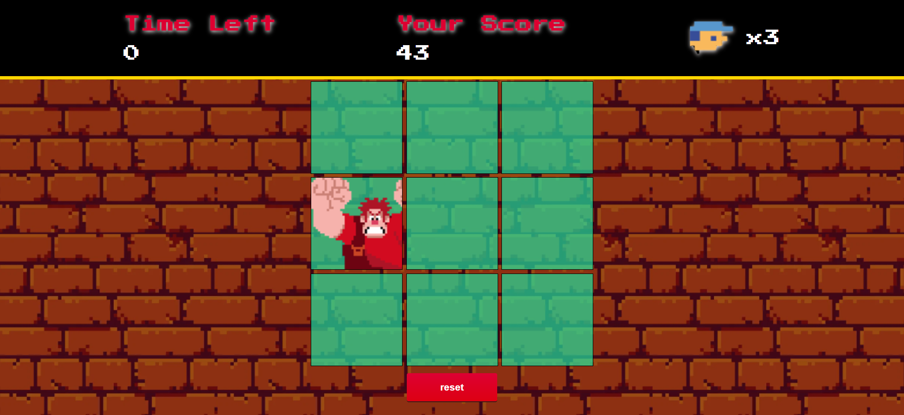

## 
Game Detona Ralph

### Créditos às aulas ministradas pela DIO : Potência Tech iFood - Desenvolvimento de Jogos

 [Clique aqui](https://detona-ralph-aula.vercel.app/) para acessar o resultado final do jogo criada a partir do desafio!

  

Bem-vindo ao **JSGame Detona Ralph**! Neste repositório, você encontrará um jogo divertido baseado no famoso filme "Detona Ralph". Este projeto não apenas oferece entretenimento, mas também demonstra várias técnicas avançadas de desenvolvimento de jogos em JavaScript.

### Tecnologias Utilizadas

- HTML5 e CSS3 para a estrutura e aparência do jogo.
- JavaScript para a lógica de programação e interatividade.
- Sprites e imagens customizadas para criar a estética única do universo de Detona Ralph.

### Funcionalidades Incríveis

- **Sistema de Pontuação**: Acompanhe sua pontuação à medida que progride no jogo e desafie seus amigos a superá-la, clique no quadrado que o Ralph se encontre

